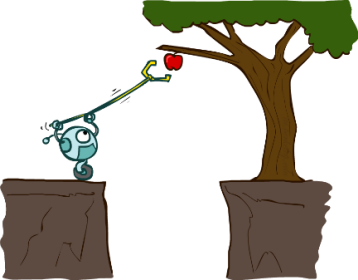

# SCI19 3611 ARTIFICIAL INTELLIGENCE and SCI19 3631 Workshop AI

> **ฉบับปรับปรุงให้ทันสมัย พ.ศ. 2569 (Modernized Syllabus):** อ้างอิงตำรา AIMA ฉบับที่ 4 (2020) สำหรับ Classical AI ในสัปดาห์ที่ 1 ถึง 7
> และปรับสัปดาห์ที่ 8 ถึง 14 เป็นแทร็ก **การใช้ AI ในยุคปัจจุบัน**: LLM, Prompting & Context Engineering, RAG, MCP, AI Agents, Harness/Skills/Plugins และ AI Automated Workflow พร้อม AI Ethics & Safety.
> รายละเอียดฉบับเต็มอยู่ใน [`TQF3_AI_Modernized.docx`](./TQF3_AI_Modernized.docx) (มคอ.3). เวอร์ชันเดิมเก็บไว้ที่ [`README_OLD_AIMA3.md`](./README_OLD_AIMA3.md).

**Instructor:** Asst. Prof. Dr. Ittipon Fongkaew  
**Email:** ittipon@g.sut.ac.th

**Classroom:** B6103-A (13:00–16:00)  
**Lab Workshop:** DIGITAL TECH LAB 03 (13:00–15:00)

**Resources:**  
[GitHub Repository](https://github.com/aofphy/SCI193611_ARTIFICIAL_INTELLIGENCE.git)

---

## 📘 Course Overview

This course introduces fundamental concepts and techniques in Artificial Intelligence, combining theoretical foundations with practical applications in Python. It runs in two halves:

- **Weeks 1–7, Classical AI:** rational agents, Search & Adversarial Search, Logic & Automated Planning, Probabilistic Reasoning and Reasoning over Time.
- **Weeks 8–14, Building with AI today:** how LLMs work, prompting & context engineering, RAG, the Model Context Protocol (MCP), AI agents & tool use, agent harnesses with Skills and Plugins, and automated AI workflows, closing with ethics, safety and responsible use.

The second half is deliberately **vendor-neutral**. Everything is built against interfaces that work across Claude, Gemini, GPT, Qwen, GLM, Kimi and open-weight models you can run locally, so the skills outlive any single provider. Every lab runs offline (local model, stub model, or dependency-free fallback) and swaps to a real API in a few lines.

The course is designed to complement the parallel Machine Learning course, deliberately avoiding overlapping Classical ML content (regression, classification, decision trees) and reinvesting that time into Classical AI (Logic & Planning) and the applied LLM/Agent/Workflow track.

**Textbook:**  
Stuart Russell, Peter Norvig – *Artificial Intelligence: A Modern Approach* (**4th Edition, 2020**)

---

## 🎯 Learning Outcomes

By the end of this course, you will be able to:

1. Understand **Agent-Based AI** and design **Rational Agents**.
2. Apply **Search & Adversarial Search** techniques, including **MCTS**.
3. Use **Logic & Automated Planning** for knowledge representation and problem solving.
4. Analyze **Probabilistic & Bayesian models**, including HMMs and filtering.
5. Explain how **LLMs** work: tokenization, attention, the Transformer, and the pretrain → SFT → RLHF pipeline, together with their concrete limitations.
6. Call LLM APIs across providers, apply **prompting patterns**, practise **context engineering**, and, critically, **measure** whether a change helped, using an eval set.
7. Build **RAG** systems with chunking, embeddings, hybrid search and reranking, and evaluate retrieval separately from generation.
8. Write and deploy a **Model Context Protocol (MCP)** server that works across multiple AI clients unchanged.
9. Build an **AI agent** from scratch: tool schemas, the agent loop, memory, guardrails, step/budget limits, and programmatic evaluation.
10. Extend an **agent harness** with **Skills**, slash commands, hooks and **plugins**, and measure whether they actually get invoked.
11. Design **automated AI workflows** (chaining, routing, parallelization, orchestrator-workers, evaluator-optimizer) with logging, budgets and human-in-the-loop approval.
12. Evaluate AI capabilities, limitations, and **ethics/safety/privacy** issues, including prompt injection, PDPA, bias, hallucination and academic integrity.

---

## 🗓️ Schedule & Topics (15 Weeks)

| Week | Main Topics | Activities / Lab / Assessment |
| --- | --- | --- |
| 1 | Introduction to AI – history, evolution, and the modern Generative AI landscape | Orientation, tooling setup (Python / Google Colab) |
| 2 | Intelligent Agents – architecture, Rational Agents, LLM-based Agents | Tutorial: Agent design |
| 3 | Problem Solving by Search – BFS, DFS, UCS, A* | Project 0: Search Algorithms |
| 4 | Adversarial Search – Minimax, Alpha-Beta Pruning, MCTS | Exercise 1 (HexaPawn) |
| 5 | Logic & Automated Planning – Propositional/First-Order Logic, Knowledge Representation | Project 1: Search & Planning |
| 6 | Quantifying Uncertainty & Probabilistic Reasoning – Bayes Rule, Bayesian Networks | Exercise 2 |
| 7 | Reasoning Over Time – Markov Models, HMMs | Exercise 3 |
| — | **Midterm Examination** (covers Weeks 1–7) | — |
| 8 | **How LLMs work** – tokenization, attention & the Transformer, sampling, pretrain → SFT → RLHF, scaling & limits | Lab: attention from scratch, run a local model |
| 9 | **Prompting, LLM APIs & Context Engineering** – roles, parameters, prompt patterns, structured output, eval sets | Lab: multi-provider client + eval harness |
| 10 | **RAG & Vector Databases** – chunking, embeddings, hybrid search, reranking, retrieval evaluation | Lab: RAG over the course documents |
| 11 | **Model Context Protocol (MCP)** – hosts/clients/servers, tools/resources/prompts, JSON-RPC, tool design & security | Lab: write an MCP server, connect 2 clients |
| 12 | **AI Agents & Tool Use** – the agent loop, ReAct, memory, failure modes, guardrails, agent evaluation | Lab: build an agent from scratch |
| 13 | **Harness, AI Skills & Plugins** – anatomy of a harness, progressive disclosure, SKILL.md, hooks, plugins | Lab: write a Skill + plugin, run on 2 harnesses |
| 14 | **AI Automated Workflows + Ethics & Safety** – workflow patterns, triggers, observability, prompt injection, PDPA, bias, academic integrity | Lab: automated workflow + threat model |
| 15 | Project Presentations & the Future of AI | Final Project Presentation |
| — | **Final Examination** (covers Weeks 8–15) | — |

---

## 💻 Projects & Assignments

- **Project 0, Search Algorithms:** implement BFS, DFS, UCS, and A* on maze/game problems.
- **Project 1, Search & Planning:** solve problems with automated planning and logical knowledge representation.
- **Project 2, Bayes Filter:** state estimation over time (HMM / particle filtering).
- **Final Project:** build and present a real AI system from the modern track: a RAG assistant over a domain corpus, an MCP server plus agent for a real workflow, or an automated AI workflow with a real trigger. Requirements: a written **threat model**, an **evaluation set with measured results**, and an **AI use statement**.
- **Weekly Labs:** [`labs/`](./labs). Every lab runs offline and swaps to a real model in a few lines.

**Responsible use policy:** you must be able to **explain every line you submit**, and every submission must include an **AI use statement** (which tools, for what, and how you verified the output). Templates are in [`labs/w14_workflow_ethics/`](./labs/w14_workflow_ethics).

**Grading:**

| Assessment Component | Weight |
| --- | --- |
| Homework & Exercises | 20% |
| Projects (Search, Planning, Bayes Filter) + Modern AI Labs | 30% |
| Midterm Examination | 20% |
| Final Project + Presentation | 20% |
| Attendance & Participation | 10% |
| **Total** | **100%** |

**Grading Scale:** A: 80–100 · B+: 75–79 · B: 70–74 · C+: 65–69 · C: 60–64 · D+: 55–59 · D: 50–54 · F: 0–49  
*(เกณฑ์อาจปรับตามดุลยพินิจของอาจารย์และระเบียบของสถาบัน)*

---

## 📂 Course Materials Map 

ตารางจับคู่กิจกรรม (Tutorial / Project / Exercise / Lab) กับเนื้อหารายสัปดาห์และไฟล์จริงในรีโพ. ช่อง "—" หมายถึงสื่อที่ยังต้องจัดทำเพิ่มสำหรับเนื้อหาสมัยใหม่.

| Week | Topic | Activity | Material in repo | AIMA (`aima/`) | Preview |
| --- | --- | --- | --- | --- | --- |
| 1 | Introduction to AI | **Tutorial:** Python / Colab setup | [`python-tutorial/`](./python-tutorial) · [`slide/lec0.pdf`](./slide/lec0.pdf), [`slide/lecture1.pdf`](./slide/lecture1.pdf) | [`intro.ipynb`](./aima/intro.ipynb) | [](./slide/lec0.pdf) |
| 2 | Intelligent Agents | **Tutorial:** Agent design | [`python-tutorial/tutorial_code/exercises/`](./python-tutorial/tutorial_code/exercises) · [`slide/lecture2.pdf`](./slide/lecture2.pdf) ([live HTML](https://raw.githack.com/aofphy/SCI193611_ARTIFICIAL_INTELLIGENCE/main/slide/lecture2.html)) | [`slide_workshop/intelligent_agents_slides2.pdf`](./aima/slide_workshop/intelligent_agents_slides2.pdf) + [`agents.ipynb`](./aima/agents.ipynb) *(BlindDog/Wumpus demo)* | [](./slide/lecture2.pdf) |
| 3 | Search – BFS/DFS/UCS/A* | **Project 0:** Search Algorithms | [`projects/project0/`](./projects/project0) · [`slide/lecture3_th.pdf`](./slide/lecture3_th.pdf) ([live HTML](https://raw.githack.com/aofphy/SCI193611_ARTIFICIAL_INTELLIGENCE/main/slide/lecture3_th.html)) | [`search.ipynb`](./aima/search.ipynb) + [`search.html`](./aima/search.html) | [](./slide/lecture3_th.pdf) |
| 4 | Adversarial Search – Minimax, MCTS | **Exercise 1 (HexaPawn)** + Minimax agent | [`slide/hexapawact.pdf`](./slide/hexapawact.pdf), [`hexapaw.html`](./hexapaw.html), [`gameHexaPawn.html`](./gameHexaPawn.html), [`projects/project1/`](./projects/project1) (Minimax) · [`slide/lecture4_th.pdf`](./slide/lecture4_th.pdf) ([live HTML](https://raw.githack.com/aofphy/SCI193611_ARTIFICIAL_INTELLIGENCE/main/slide/lecture4_th.html)) | [`slide_workshop/Game-Playing.pdf`](./aima/slide_workshop/Game-Playing.pdf) + [`games.ipynb`](./aima/games.ipynb) *(Minimax/Alpha-Beta)* | [](./slide/lecture4_th.pdf) |
| 5 | Logic & Automated Planning | **Project 1:** Search & Planning | [`labs/w05_logic_planning.ipynb`](./labs/w05_logic_planning.ipynb) *(runnable)* | [`slide_workshop/10-Knowledge-Base.pdf`](./aima/slide_workshop/10-Knowledge-Base.pdf) + [`logic.ipynb`](./aima/logic.ipynb), [`slide_workshop/CSP_proposition.pdf`](./aima/slide_workshop/CSP_proposition.pdf) + [`csp.ipynb`](./aima/csp.ipynb) (CSP + Prop. Logic), [`slide_workshop/12-Basic-Planning.pdf`](./aima/slide_workshop/12-Basic-Planning.pdf) + [`planning.ipynb`](./aima/planning.ipynb) | — |
| 6 | Probabilistic Reasoning – Bayes Nets | **Exercise 2** | [`code/lecture5-cherries.ipynb`](./code/lecture5-cherries.ipynb) · [`slide/lecture5_th.pdf`](./slide/lecture5_th.pdf) ([live HTML](https://raw.githack.com/aofphy/SCI193611_ARTIFICIAL_INTELLIGENCE/main/slide/lecture5_th.html)) | — | [](./slide/lecture5_th.pdf) |
| 7 | Reasoning Over Time – Markov, HMM | **Exercise 3** + Bayes Filter | [`exercises/e3_nosol.pdf`](./exercises/e3_nosol.pdf), [`code/lecture6-forward-backward.ipynb`](./code/lecture6-forward-backward.ipynb), [`code/particle-filtering/`](./code/particle-filtering), [`code/exercises-4-kalman.ipynb`](./code/exercises-4-kalman.ipynb), [`projects/project2/`](./projects/project2) (Bayes Filter) · [`slide/lecture6_th.pdf`](./slide/lecture6_th.pdf) ([live HTML](https://raw.githack.com/aofphy/SCI193611_ARTIFICIAL_INTELLIGENCE/main/slide/lecture6_th.html)) | — | [](./slide/lecture6_th.pdf) |
| 8 | How LLMs work | **Lab:** attention from scratch | [`labs/w08_llm_internals.ipynb`](./labs/w08_llm_internals.ipynb) *(runnable)* · [`slide/w08_llm_th.pdf`](./slide/w08_llm_th.pdf) ([live HTML](https://raw.githack.com/aofphy/SCI193611_ARTIFICIAL_INTELLIGENCE/main/slide/w08_llm_th.html)) | — | — |
| 9 | Prompting & Context Engineering | **Lab:** multi-provider client + evals | [`labs/w09_prompting_context.ipynb`](./labs/w09_prompting_context.ipynb) *(runnable)* · [`slide/w09_prompting_th.pdf`](./slide/w09_prompting_th.pdf) ([live HTML](https://raw.githack.com/aofphy/SCI193611_ARTIFICIAL_INTELLIGENCE/main/slide/w09_prompting_th.html)) | — | — |
| 10 | RAG & Vector DB | **Lab:** RAG over course documents | [`labs/w10_rag.ipynb`](./labs/w10_rag.ipynb) *(runnable)* · [`slide/w10_rag_th.pdf`](./slide/w10_rag_th.pdf) ([live HTML](https://raw.githack.com/aofphy/SCI193611_ARTIFICIAL_INTELLIGENCE/main/slide/w10_rag_th.html)) | — | — |
| 11 | Model Context Protocol (MCP) | **Lab:** write an MCP server | [`labs/w11_mcp_server.ipynb`](./labs/w11_mcp_server.ipynb) + [`labs/w11_server/`](./labs/w11_server) *(runnable)* · [`slide/w11_mcp_th.pdf`](./slide/w11_mcp_th.pdf) ([live HTML](https://raw.githack.com/aofphy/SCI193611_ARTIFICIAL_INTELLIGENCE/main/slide/w11_mcp_th.html)) | — | — |
| 12 | AI Agents & Tool Use | **Lab:** agent from scratch | [`labs/w12_agent.ipynb`](./labs/w12_agent.ipynb) *(runnable)* · [`slide/w12_agents_th.pdf`](./slide/w12_agents_th.pdf) ([live HTML](https://raw.githack.com/aofphy/SCI193611_ARTIFICIAL_INTELLIGENCE/main/slide/w12_agents_th.html)) | — | — |
| 13 | Harness, Skills & Plugins | **Lab:** Skill + plugin | [`labs/w13_skills_plugin/`](./labs/w13_skills_plugin) *(runnable)* · [`slide/w13_harness_skills_th.pdf`](./slide/w13_harness_skills_th.pdf) ([live HTML](https://raw.githack.com/aofphy/SCI193611_ARTIFICIAL_INTELLIGENCE/main/slide/w13_harness_skills_th.html)) | — | — |
| 14 | AI Workflows + Ethics & Safety | **Lab:** automated workflow + threat model | [`labs/w14_workflow_ethics/`](./labs/w14_workflow_ethics) *(runnable)* · [`slide/w14_workflow_ethics_th.pdf`](./slide/w14_workflow_ethics_th.pdf) ([live HTML](https://raw.githack.com/aofphy/SCI193611_ARTIFICIAL_INTELLIGENCE/main/slide/w14_workflow_ethics_th.html)) | — | — |
| 15 | Project Presentations | **Final Project** | [`projects/`](./projects) (ต่อยอดเป็น final project) | — | — |

**สื่อเสริม / legacy (นอกแกนหลัก 15 สัปดาห์)** ใช้ประกอบหรือเป็นงานต่อยอดได้ตามความเหมาะสม:

| หัวข้อ | สื่อ |
| --- | --- |
| Neural Networks & Deep Learning (PyTorch, CNN) | [`code/lecture7-spiral.ipynb`](./code/lecture7-spiral.ipynb), [`code/lecture7-convnet.ipynb`](./code/lecture7-convnet.ipynb), [`slide/lecture7_thai.pdf`](./slide/lecture7_thai.pdf), [`slide/lecture8_thai.pdf`](./slide/lecture8_thai.pdf) |
| Transformer ฉบับเต็มด้วย NumPy | [`labs/legacy/transformer_numpy.ipynb`](./labs/legacy/transformer_numpy.ipynb) |
| Fine-tuning ด้วย LoRA, Diffusion | [`labs/legacy/llm_finetune_lora.ipynb`](./labs/legacy/llm_finetune_lora.ipynb), [`labs/legacy/generative_ai_diffusion.ipynb`](./labs/legacy/generative_ai_diffusion.ipynb) |
| MDP & Reinforcement Learning | [`code/lecture8-mdp.ipynb`](./code/lecture8-mdp.ipynb), [`code/q-learning-demo/`](./code/q-learning-demo), [`slide/lecture9_thai.pdf`](./slide/lecture9_thai.pdf) |

---

## 🛠️ Prerequisites & Setup

**Prerequisites:**
- Python programming (basic NumPy, pandas, matplotlib)
- Basic math: Linear Algebra, Calculus, and Probability

**Tools & Software:**

- **Anaconda Platform** – [Download](https://www.anaconda.com/) · **Visual Studio Code** – [Download](https://code.visualstudio.com/)
- **Google Colab** (optional, for GPU work)
- Core libraries: NumPy, pandas, matplotlib · **PyTorch** and **Hugging Face Transformers** for the legacy deep-learning material

**Modern AI track (weeks 8–14).** Everything below is optional: each lab has an offline path that runs with the standard library plus NumPy. Install what you need as you go.

| Purpose | Tool |
| --- | --- |
| Run open-weight models locally (free, data never leaves your machine) | **[Ollama](https://ollama.com)**, `ollama pull qwen3:8b` |
| Call any provider through one OpenAI-compatible interface | [`labs/llm.py`](./labs/llm.py), standard library only. Works with OpenRouter, Qwen, GLM, Kimi, Gemini, GPT and Ollama by changing `base_url` |
| Use a hosted model without paying | **[OpenRouter](https://openrouter.ai/)** free tier: set `OPENROUTER_API_KEY`, pick a `:free` model. List what is available right now with `python labs/llm.py --free` |
| Real tokenizers and embeddings | `pip install transformers sentence-transformers` |
| Vector store for RAG | `pip install chromadb` (or FAISS / pgvector) |
| Build MCP servers | `pip install "mcp[cli]"` + `npx @modelcontextprotocol/inspector` |
| Agent harness to experiment with | Claude Code, Gemini CLI, Qwen Code, Codex CLI, Cline, Aider. Pick at least one open-source one |

> **API keys** live in environment variables or a `.env` file that is in `.gitignore`. **Never commit a key.**
> If you have no budget, the OpenRouter free tier covers every lab in weeks 8 to 14. Free requests are rate-limited, and OpenRouter has a separate account setting controlling whether free requests may be routed to providers that train on your data, so never send personal or unpublished material through it.
> The course deliberately teaches provider-neutral interfaces so your work is not locked to one vendor.

### 🪟 A Unix-like terminal on Windows (Git-Bash / MSYS2)

คำสั่งและสคริปต์ในรายวิชาเขียนแบบ Unix shell. นักศึกษา Windows แนะนำให้ใช้ bash environment เพื่อให้ทำตามได้ตรง ๆ — เลือกอย่างใดอย่างหนึ่ง:

**ตัวเลือก A — Git-Bash (ง่าย, แนะนำสำหรับเริ่มต้น)**  
มาพร้อม [Git for Windows](https://gitforwindows.org/) — ได้ `bash` + `git` ที่ตั้งค่าพร้อมใช้ เหมาะกับงานทั่วไปในวิชานี้ (clone repo, รันสคริปต์, ใช้ git). ข้อจำกัด: ไม่มี `tmux` และติดตั้งแพ็กเกจเพิ่มไม่ได้ง่าย.

**ตัวเลือก B — MSYS2 (เต็มรูปแบบ, มี package manager)**  
ให้สภาพแวดล้อมคล้าย Linux เกือบเต็มรูปแบบ พร้อมตัวจัดการแพ็กเกจ `pacman`:

```bash
# 1) ติดตั้งจาก https://www.msys2.org/ แล้วเปิด MSYS2 จาก Start menu
# 2) อัปเดตแพ็กเกจ (รันซ้ำ + ปิด-เปิด terminal ใหม่ตามที่ระบบแจ้ง)
pacman -Syu
pacman -Su
# 3) ติดตั้งเครื่องมือที่ใช้บ่อย
pacman -S git vim tmux tig man-db
```

**ตั้งค่าที่ควรทำหลังติดตั้ง (ทั้งสองตัวเลือก):**

```bash
# line endings: เช็คเอาท์แบบ Windows, เช็คอินแบบ Unix
git config --global core.autocrlf true

# ให้ Python พิมพ์ output ต่อเนื่องใน MSYS2/Git-Bash (กัน buffering)
alias python='winpty python.exe'
```

> ติดตั้ง Python จาก [python.org](https://www.python.org/) หรือใช้ Anaconda. ทางเลือกสมัยใหม่อีกทางคือ **WSL2** (Ubuntu บน Windows) ซึ่งให้ Linux จริง ๆ และเข้ากันได้ดีกับ GPU/CUDA.

### Recommended Resources

**Weeks 1–7 (Classical AI)**

- Russell & Norvig, *Artificial Intelligence: A Modern Approach* (4th Ed., 2020), *primary textbook*
- [Python Data Science Handbook](https://github.com/jakevdp/PythonDataScienceHandbook), [scikit-learn](https://scikit-learn.org/stable/)

**Weeks 8–14 (Building with AI)**

- Jurafsky & Martin, *Speech and Language Processing* (3rd Ed. draft, online), chapters on Transformers and LLMs
- [Model Context Protocol specification and SDKs](https://modelcontextprotocol.io): the open standard used in week 11
- Hugging Face: NLP/LLM Course and [Transformers documentation](https://huggingface.co/docs/transformers)
- Documentation for whichever harness you use (Claude Code, Gemini CLI, Cline, Aider). Read its docs on instruction files, skills/rules, hooks and MCP configuration
- Provider docs for prompting, structured output and tool use: Anthropic, Google, OpenAI, Alibaba (Qwen), Zhipu (GLM), Moonshot (Kimi)

**Legacy / enrichment**

- Goodfellow, Bengio & Courville, *Deep Learning* (MIT Press) · [PyTorch docs](https://pytorch.org/)

---

## 📚 License & Acknowledgements

This course material is for educational purposes. The core textbook content belongs to the respective authors and publishers.

---

> **Note:** For detailed instructions and the latest updates, refer to the [GitHub Repository](https://github.com/aofphy/SCI193611_ARTIFICIAL_INTELLIGENCE.git).

> **tool:**
> - HexaPawn random Tools — [link](https://script.google.com/macros/s/AKfycbwZbR1ANc-vn_shok9lHtHCWOogzCt8fbsJabfxN0IAkB5QhFY1-8nPxMPzaNa7donrrg/exec)
> - HexaPawn gameplay — [link](https://script.google.com/macros/s/AKfycbzA75-egsQ1B7hNQA7vaXnQy_IvOtgeVkrtk9KCqRFYk3NU7PXdwcsbR2hVyk1proBwfw/exec)
